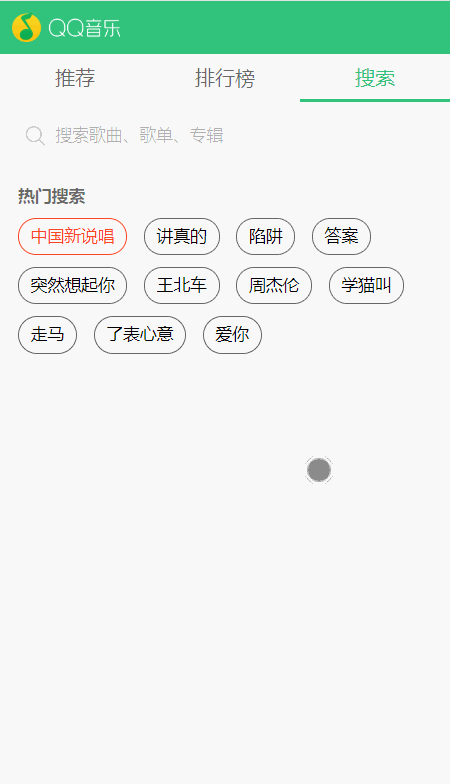
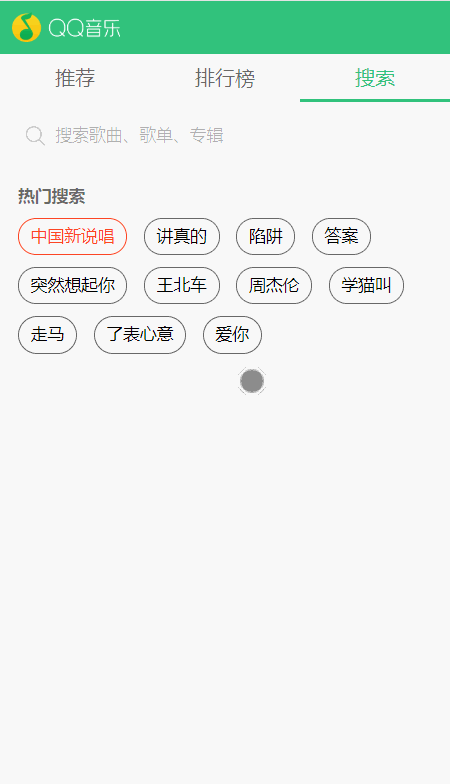

# qqmusic

> 该项目是基于`Vue.js`来实现的一个移动端webapp，界面仿照于QQ音乐移动端的官网。

### **技术栈**

- [x] Vue
- [x] Vue-Router
- [x] Vue-Cli
- [x] Sass/Scss
- [x] ES6...

### **数据来源**

> **项目用到的数据为qq音乐的官方接口，主要通过jsonp的方式获取**

### **运行效果**

- **首页**


- **排行榜页**


- **搜索页**



- **上拉加载**



### Build Setup

``` bash
# install dependencies
npm install
或者
yarn install

# serve with hot reload at localhost:8080
npm run dev
或者
yarn dev

# build for production with minification
npm run build
或者
yarn build

# build for production and view the bundle analyzer report
npm run build --report
```


